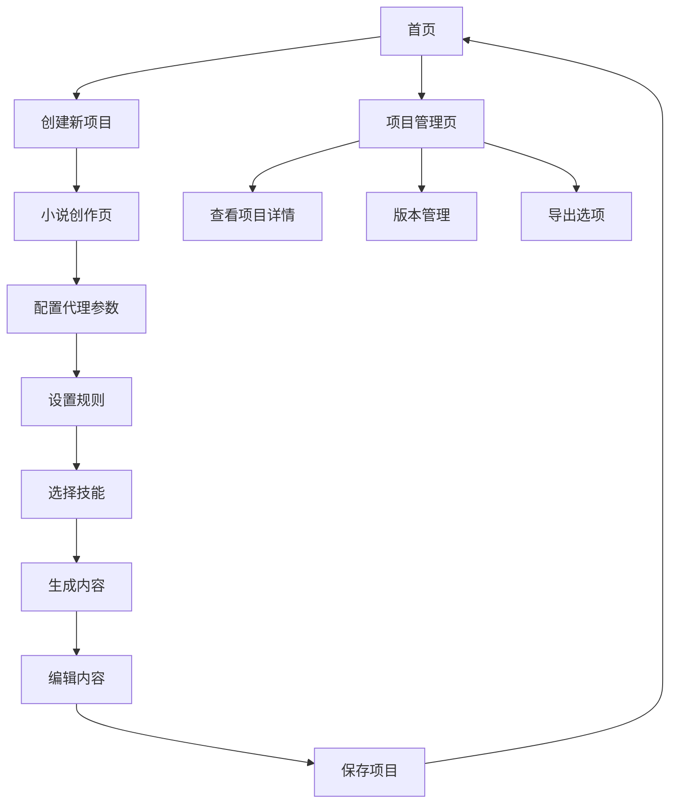

## 1. Product Overview
小说创作平台，利用智能代理（Agent）进行小说内容生成和管理
- 提供用户友好的界面，让用户可以通过设置规则和技能来创建任何类型的小说
- 目标用户为作家、编剧和文学爱好者，帮助他们快速生成创意内容

## 2. Core Features

### 2.1 User Roles
| 角色 | 注册方式 | 核心权限 |
|------|---------------------|------------------|
| 普通用户 | 邮箱注册 | 创建和管理小说项目，使用基础代理功能 |
| 高级用户 | 付费升级 | 访问更多高级代理技能，导出小说内容 |

### 2.2 Feature Module
1. **首页**：项目列表，创建新项目按钮，用户信息
2. **小说创作页**：代理配置，规则设置，技能选择，内容生成区域
3. **项目管理页**：项目详情，版本管理，导出选项

### 2.3 Page Details
| 页面名称 | 模块名称 | 功能描述 |
|-----------|-------------|---------------------|
| 首页 | 项目列表 | 显示用户创建的所有小说项目，支持按名称、创建时间排序 |
| 首页 | 创建新项目 | 点击按钮创建新的小说项目，设置项目名称和类型 |
| 小说创作页 | 代理配置 | 配置代理的基本参数，如创作风格、语言类型、内容长度 |
| 小说创作页 | 规则设置 | 设置小说的核心规则，如世界观设定、人物设定、情节发展方向 |
| 小说创作页 | 技能选择 | 选择代理可以使用的技能，如对话生成、场景描述、人物塑造 |
| 小说创作页 | 内容生成区域 | 显示生成的小说内容，支持实时编辑和调整 |
| 项目管理页 | 项目详情 | 查看项目的基本信息，如创建时间、更新时间、总字数 |
| 项目管理页 | 版本管理 | 查看和恢复历史版本，比较不同版本的差异 |
| 项目管理页 | 导出选项 | 支持导出为PDF、Word、TXT等格式 |

## 3. Core Process
用户创作小说的主要流程：
1. 用户登录平台，进入首页
2. 点击"创建新项目"按钮，设置项目基本信息
3. 进入小说创作页，配置代理参数、设置规则和选择技能
4. 点击"生成内容"按钮，代理开始生成小说内容
5. 用户可以编辑和调整生成的内容
6. 保存项目，返回首页
7. 可以在项目管理页查看和管理项目

## 4. User Interface Design
### 4.1 Design Style
- 主色调：深蓝色 (#1a237e) 和金色 (#ffd700)
- 次要色调：浅灰色 (#f5f5f5) 和深灰色 (#424242)
- 按钮风格：圆角矩形，有轻微的3D效果
- 字体：标题使用 Playfair Display，正文使用 Lora
- 字体大小：标题 24-36px，副标题 18-24px，正文 14-16px
- 布局风格：卡片式布局，清晰的层次结构
- 图标风格：简约线条图标，搭配文学相关元素

### 4.2 Page Design Overview
| 页面名称 | 模块名称 | UI元素 |
|-----------|-------------|-------------|
| 首页 | 项目列表 | 卡片式布局，每个卡片显示项目名称、类型、创建时间，悬停效果显示更多信息 |
| 首页 | 创建新项目 | 突出的金色按钮，点击后弹出模态框，表单输入项目信息 |
| 小说创作页 | 代理配置 | 侧边栏形式，包含多个滑块和选择器，实时预览配置效果 |
| 小说创作页 | 规则设置 | 文本输入区域，支持富文本编辑，可添加标签和分类 |
| 小说创作页 | 技能选择 | 卡片式选择，每个技能显示图标和描述，可拖拽排序 |
| 小说创作页 | 内容生成区域 | 主内容区域，类似编辑器界面，支持实时预览和编辑 |
| 项目管理页 | 项目详情 | 顶部信息栏，显示项目基本信息，下方是内容预览 |
| 项目管理页 | 版本管理 | 时间轴形式，显示每个版本的创建时间和变更内容 |
| 项目管理页 | 导出选项 | 下拉菜单，选择导出格式，点击后开始导出过程 |

### 4.3 Responsiveness
- 桌面优先设计，支持响应式布局
- 在平板设备上，侧边栏可折叠，内容区域自适应
- 在移动设备上，采用单栏布局，通过标签页切换不同功能区域
- 支持触摸操作，按钮和交互元素尺寸适合手指点击

### 4.4 3D Scene Guidance
- 不适用，本项目为2D界面应用