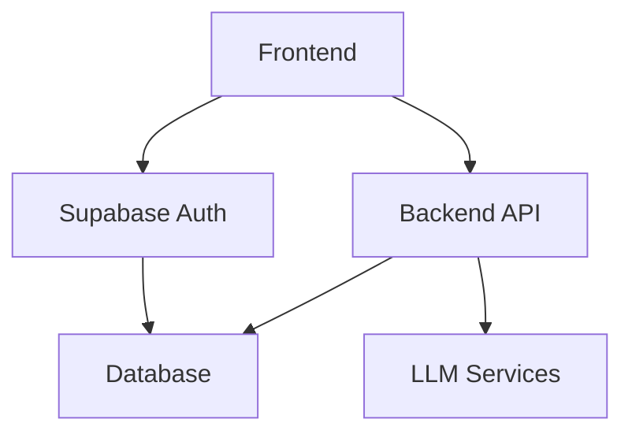
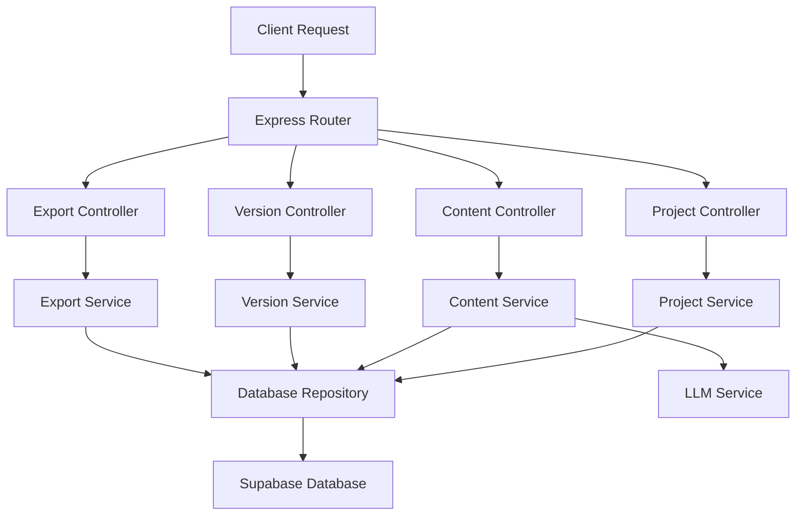
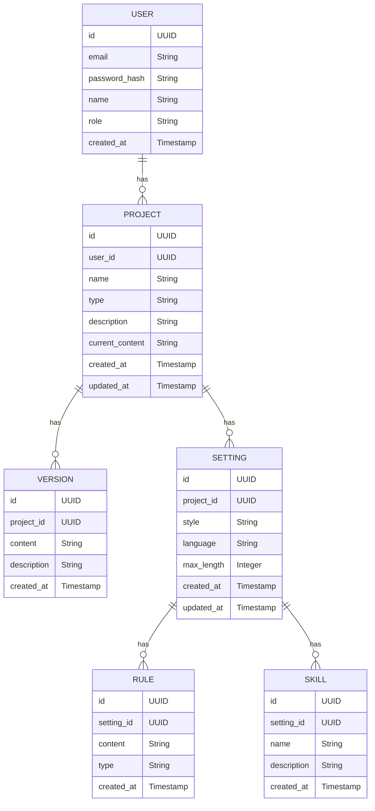

## 1. Architecture Design


## 2. Technology Description
- Frontend: React@18 + Tailwind CSS@3 + Vite
- Initialization Tool: vite-init
- Backend: Express@4
- Database: Supabase (PostgreSQL)
- Authentication: Supabase Auth
- LLM Services: OpenAI API

## 3. Route Definitions
| 路由 | 用途 |
|-------|---------|
| / | 首页，显示项目列表 |
| /create | 创建新项目页面 |
| /project/:id | 小说创作页 |
| /project/:id/settings | 项目设置页面 |
| /project/:id/versions | 版本管理页面 |
| /project/:id/export | 导出选项页面 |
| /profile | 用户个人资料页面 |
| /login | 登录页面 |
| /register | 注册页面 |

## 4. API Definitions
### 4.1 项目相关 API
| 端点 | 方法 | 功能 | 请求体 | 响应体 |
|-------|------|---------|---------|---------|
| /api/projects | GET | 获取用户的项目列表 | N/A | `{ projects: Project[] }` |
| /api/projects | POST | 创建新项目 | `{ name: string, type: string, description: string }` | `{ project: Project }` |
| /api/projects/:id | GET | 获取项目详情 | N/A | `{ project: Project }` |
| /api/projects/:id | PUT | 更新项目信息 | `{ name: string, description: string }` | `{ project: Project }` |
| /api/projects/:id | DELETE | 删除项目 | N/A | `{ success: boolean }` |

### 4.2 内容生成 API
| 端点 | 方法 | 功能 | 请求体 | 响应体 |
|-------|------|---------|---------|---------|
| /api/generate | POST | 生成小说内容 | `{ projectId: string, prompt: string, rules: string[], skills: string[] }` | `{ content: string }` |

### 4.3 版本管理 API
| 端点 | 方法 | 功能 | 请求体 | 响应体 |
|-------|------|---------|---------|---------|
| /api/projects/:id/versions | GET | 获取项目版本列表 | N/A | `{ versions: Version[] }` |
| /api/projects/:id/versions | POST | 创建新版本 | `{ content: string, description: string }` | `{ version: Version }` |
| /api/projects/:id/versions/:versionId | GET | 获取版本详情 | N/A | `{ version: Version }` |

### 4.4 导出 API
| 端点 | 方法 | 功能 | 请求体 | 响应体 |
|-------|------|---------|---------|---------|
| /api/projects/:id/export | POST | 导出项目内容 | `{ format: string }` | `{ url: string }` |

## 5. Server Architecture Diagram


## 6. Data Model
### 6.1 Data Model Definition


### 6.2 Data Definition Language
```sql
-- 创建用户表
CREATE TABLE users (
  id UUID PRIMARY KEY DEFAULT gen_random_uuid(),
  email VARCHAR(255) UNIQUE NOT NULL,
  password_hash VARCHAR(255) NOT NULL,
  name VARCHAR(255) NOT NULL,
  role VARCHAR(50) DEFAULT 'user',
  created_at TIMESTAMP DEFAULT NOW()
);

-- 创建项目表
CREATE TABLE projects (
  id UUID PRIMARY KEY DEFAULT gen_random_uuid(),
  user_id UUID REFERENCES users(id),
  name VARCHAR(255) NOT NULL,
  type VARCHAR(100) NOT NULL,
  description TEXT,
  current_content TEXT,
  created_at TIMESTAMP DEFAULT NOW(),
  updated_at TIMESTAMP DEFAULT NOW()
);

-- 创建版本表
CREATE TABLE versions (
  id UUID PRIMARY KEY DEFAULT gen_random_uuid(),
  project_id UUID REFERENCES projects(id),
  content TEXT NOT NULL,
  description VARCHAR(255),
  created_at TIMESTAMP DEFAULT NOW()
);

-- 创建设置表
CREATE TABLE settings (
  id UUID PRIMARY KEY DEFAULT gen_random_uuid(),
  project_id UUID REFERENCES projects(id),
  style VARCHAR(100),
  language VARCHAR(100),
  max_length INTEGER,
  created_at TIMESTAMP DEFAULT NOW(),
  updated_at TIMESTAMP DEFAULT NOW()
);

-- 创建规则表
CREATE TABLE rules (
  id UUID PRIMARY KEY DEFAULT gen_random_uuid(),
  setting_id UUID REFERENCES settings(id),
  content TEXT NOT NULL,
  type VARCHAR(100),
  created_at TIMESTAMP DEFAULT NOW()
);

-- 创建技能表
CREATE TABLE skills (
  id UUID PRIMARY KEY DEFAULT gen_random_uuid(),
  setting_id UUID REFERENCES settings(id),
  name VARCHAR(100) NOT NULL,
  description TEXT,
  created_at TIMESTAMP DEFAULT NOW()
);

-- 创建索引
CREATE INDEX idx_projects_user_id ON projects(user_id);
CREATE INDEX idx_versions_project_id ON versions(project_id);
CREATE INDEX idx_settings_project_id ON settings(project_id);
CREATE INDEX idx_rules_setting_id ON rules(setting_id);
CREATE INDEX idx_skills_setting_id ON skills(setting_id);

-- 授予权限
GRANT SELECT ON users, projects, versions, settings, rules, skills TO anon;
GRANT ALL PRIVILEGES ON users, projects, versions, settings, rules, skills TO authenticated;
```