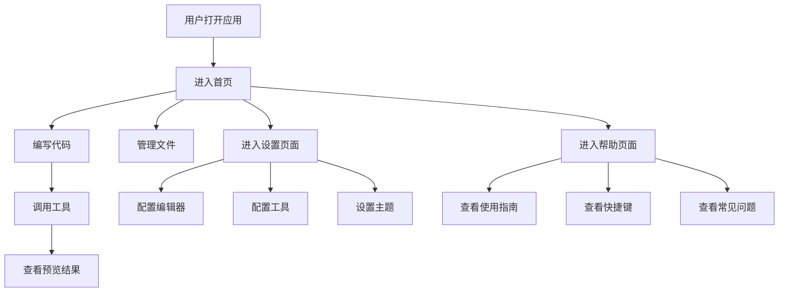

## 1. Product Overview
复刻 trae web solo 功能的 Svelte 5 应用，提供类似的交互体验和功能。
- 主要功能包括代码编辑、工具调用、文件管理和项目预览等核心功能
- 目标用户为开发者，提供便捷的开发环境和工具集成体验

## 2. Core Features

### 2.1 User Roles
| Role | Registration Method | Core Permissions |
|------|---------------------|------------------|
| Developer | 无需注册 | 使用所有功能，包括代码编辑、工具调用、文件管理 |

### 2.2 Feature Module
1. **首页**：代码编辑器、工具调用面板、文件管理、预览区域
2. **设置页面**：编辑器设置、工具配置、主题设置
3. **帮助页面**：使用指南、快捷键说明、常见问题

### 2.3 Page Details
| Page Name | Module Name | Feature description |
|-----------|-------------|---------------------|
| 首页 | 代码编辑器 | 支持多种编程语言，语法高亮，自动补全，代码格式化 |
| 首页 | 工具调用面板 | 集成多种开发工具，支持工具参数配置和执行 |
| 首页 | 文件管理 | 创建、编辑、删除文件，支持目录结构管理 |
| 首页 | 预览区域 | 实时预览代码执行结果，支持 web 应用预览 |
| 设置页面 | 编辑器设置 | 配置字体大小、主题、缩进等编辑器参数 |
| 设置页面 | 工具配置 | 管理工具参数和默认设置 |
| 设置页面 | 主题设置 | 切换亮色/暗色主题，自定义主题颜色 |
| 帮助页面 | 使用指南 | 详细的功能使用说明和操作步骤 |
| 帮助页面 | 快捷键说明 | 编辑器和工具的快捷键列表 |
| 帮助页面 | 常见问题 | 常见问题解答和故障排除 |

## 3. Core Process
用户打开应用后，可以在代码编辑器中编写代码，通过工具调用面板执行各种开发工具，管理项目文件，并在预览区域查看代码执行结果。用户可以通过设置页面自定义编辑器和工具配置，通过帮助页面获取使用指导。

## 4. User Interface Design
### 4.1 Design Style
- 主色调：深蓝色 (#1e3a8a) 和浅蓝色 (#3b82f6)
- 辅助色：灰色 (#6b7280)、绿色 (#10b981)、红色 (#ef4444)
- 按钮风格：圆角按钮，带有轻微的阴影效果
- 字体：主要使用 Inter 字体，代码使用等宽字体
- 布局风格：分栏式布局，左侧文件管理，中间代码编辑，右侧工具和预览
- 图标风格：使用 Lucide 图标库，风格简洁现代

### 4.2 Page Design Overview
| Page Name | Module Name | UI Elements |
|-----------|-------------|-------------|
| 首页 | 代码编辑器 | 深色背景 (#1e1e1e)，语法高亮，行号显示，滚动条样式 |
| 首页 | 工具调用面板 | 卡片式布局，工具图标，参数输入框，执行按钮 |
| 首页 | 文件管理 | 树形结构，文件夹展开/折叠，文件图标，右键菜单 |
| 首页 | 预览区域 | 白色背景，内容居中，加载动画，错误提示 |
| 设置页面 | 编辑器设置 | 表单布局，滑块控件，下拉选择，开关按钮 |
| 设置页面 | 工具配置 | 表格布局，编辑按钮，删除按钮，添加按钮 |
| 设置页面 | 主题设置 | 主题预览，颜色选择器，切换按钮 |
| 帮助页面 | 使用指南 | 卡片式布局，步骤说明，截图示例 |
| 帮助页面 | 快捷键说明 | 表格布局，快捷键组合，功能说明 |
| 帮助页面 | 常见问题 | 折叠面板，问题标题，答案内容 |

### 4.3 Responsiveness
- 桌面优先设计，支持响应式布局
- 在平板设备上，布局调整为上下结构
- 在移动设备上，使用抽屉式菜单和标签页切换不同功能区域
- 支持触摸操作，优化移动设备的交互体验

### 4.4 3D Scene Guidance
- 无 3D 场景需求