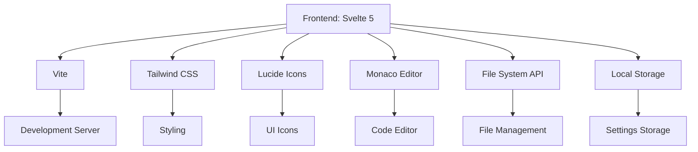

#### 1. Architecture Design
```mermaid
g## 1. Architecture Design
```mermaid
graph TD
    A[Frontend: Svelte 5] --> B[Vite## 1. Architecture Design
```mermaid
graph TD
    A[Frontend: Svelte 5] --> B[Vite]
    A --> C[Tailwind CSS## 1. Architecture Design
```mermaid
graph TD
    A[Frontend: Svelte 5] --> B[Vite]
    A --> C[Tailwind CSS]
    A --> D[Lucide Icons]
    A --> E[Monaco Editor## 1. Architecture Design
```mermaid
graph TD
    A[Frontend: Svelte 5] --> B[Vite]
    A --> C[Tailwind CSS]
    A --> D[Lucide Icons]
    A --> E[Monaco Editor]
    A --> F[File System API## 1. Architecture Design
```mermaid
graph TD
    A[Frontend: Svelte 5] --> B[Vite]
    A --> C[Tailwind CSS]
    A --> D[Lucide Icons]
    A --> E[Monaco Editor]
    A --> F[File System API]
    A --> G[Local Storage]
    
    B --> H[Development## 1. Architecture Design
```mermaid
graph TD
    A[Frontend: Svelte 5] --> B[Vite]
    A --> C[Tailwind CSS]
    A --> D[Lucide Icons]
    A --> E[Monaco Editor]
    A --> F[File System API]
    A --> G[Local Storage]
    
    B --> H[Development Server]
    C --> I[Styling]
    D --> J[UI Icons]
    E --> K[Code Editor]
## 1. Architecture Design
```mermaid
graph TD
    A[Frontend: Svelte 5] --> B[Vite]
    A --> C[Tailwind CSS]
    A --> D[Lucide Icons]
    A --> E[Monaco Editor]
    A --> F[File System API]
    A --> G[Local Storage]
    
    B --> H[Development Server]
    C --> I[Styling]
    D --> J[UI Icons]
    E --> K[Code Editor]
    F --> L[File Management]
## 1. Architecture Design
```mermaid
graph TD
    A[Frontend: Svelte 5] --> B[Vite]
    A --> C[Tailwind CSS]
    A --> D[Lucide Icons]
    A --> E[Monaco Editor]
    A --> F[File System API]
    A --> G[Local Storage]
    
    B --> H[Development Server]
    C --> I[Styling]
    D --> J[UI Icons]
    E --> K[Code Editor]
    F --> L[File Management]
    G --> M[Settings Storage]
```

## 2. Technology Description
-## 1. Architecture Design


## 2. Technology Description
- Frontend: Svelte 5 + tailwindcss@3 + vite
- Initialization## 1. Architecture Design


## 2. Technology Description
- Frontend: Svelte 5 + tailwindcss@3 + vite
- Initialization Tool: vite-init
- Backend: None (纯前端应用)
- Database: Local## 1. Architecture Design


## 2. Technology Description
- Frontend: Svelte 5 + tailwindcss@3 + vite
- Initialization Tool: vite-init
- Backend: None (纯前端应用)
- Database: Local Storage (存储设置和用户数据)
- Editor: Monaco Editor (代码编辑功能)
## 1. Architecture Design


## 2. Technology Description
- Frontend: Svelte 5 + tailwindcss@3 + vite
- Initialization Tool: vite-init
- Backend: None (纯前端应用)
- Database: Local Storage (存储设置和用户数据)
- Editor: Monaco Editor (代码编辑功能)
- Icons: Lucide Icons (UI 图标)
- Styling: Tailwind CSS (## 1. Architecture Design


## 2. Technology Description
- Frontend: Svelte 5 + tailwindcss@3 + vite
- Initialization Tool: vite-init
- Backend: None (纯前端应用)
- Database: Local Storage (存储设置和用户数据)
- Editor: Monaco Editor (代码编辑功能)
- Icons: Lucide Icons (UI 图标)
- Styling: Tailwind CSS (样式管理)

## 3. Route## 1. Architecture Design


## 2. Technology Description
- Frontend: Svelte 5 + tailwindcss@3 + vite
- Initialization Tool: vite-init
- Backend: None (纯前端应用)
- Database: Local Storage (存储设置和用户数据)
- Editor: Monaco Editor (代码编辑功能)
- Icons: Lucide Icons (UI 图标)
- Styling: Tailwind CSS (样式管理)

## 3. Route Definitions
| Route | Purpose |
|-------|---------|
| / | 首页## 1. Architecture Design


## 2. Technology Description
- Frontend: Svelte 5 + tailwindcss@3 + vite
- Initialization Tool: vite-init
- Backend: None (纯前端应用)
- Database: Local Storage (存储设置和用户数据)
- Editor: Monaco Editor (代码编辑功能)
- Icons: Lucide Icons (UI 图标)
- Styling: Tailwind CSS (样式管理)

## 3. Route Definitions
| Route | Purpose |
|-------|---------|
| / | 首页，包含代码编辑器、工具调用面板、文件## 1. Architecture Design


## 2. Technology Description
- Frontend: Svelte 5 + tailwindcss@3 + vite
- Initialization Tool: vite-init
- Backend: None (纯前端应用)
- Database: Local Storage (存储设置和用户数据)
- Editor: Monaco Editor (代码编辑功能)
- Icons: Lucide Icons (UI 图标)
- Styling: Tailwind CSS (样式管理)

## 3. Route Definitions
| Route | Purpose |
|-------|---------|
| / | 首页，包含代码编辑器、工具调用面板、文件管理和预览区域 |
| /settings | 设置页面，配置编辑器、工具和主题## 1. Architecture Design


## 2. Technology Description
- Frontend: Svelte 5 + tailwindcss@3 + vite
- Initialization Tool: vite-init
- Backend: None (纯前端应用)
- Database: Local Storage (存储设置和用户数据)
- Editor: Monaco Editor (代码编辑功能)
- Icons: Lucide Icons (UI 图标)
- Styling: Tailwind CSS (样式管理)

## 3. Route Definitions
| Route | Purpose |
|-------|---------|
| / | 首页，包含代码编辑器、工具调用面板、文件管理和预览区域 |
| /settings | 设置页面，配置编辑器、工具和主题 |
| /help | 帮助页面，包含使用指南、快捷键说明和常见问题## 1. Architecture Design


## 2. Technology Description
- Frontend: Svelte 5 + tailwindcss@3 + vite
- Initialization Tool: vite-init
- Backend: None (纯前端应用)
- Database: Local Storage (存储设置和用户数据)
- Editor: Monaco Editor (代码编辑功能)
- Icons: Lucide Icons (UI 图标)
- Styling: Tailwind CSS (样式管理)

## 3. Route Definitions
| Route | Purpose |
|-------|---------|
| / | 首页，包含代码编辑器、工具调用面板、文件管理和预览区域 |
| /settings | 设置页面，配置编辑器、工具和主题 |
| /help | 帮助页面，包含使用指南、快捷键说明和常见问题 |

## 4. API Definitions
无后端 API，所有功能均在前端## 1. Architecture Design


## 2. Technology Description
- Frontend: Svelte 5 + tailwindcss@3 + vite
- Initialization Tool: vite-init
- Backend: None (纯前端应用)
- Database: Local Storage (存储设置和用户数据)
- Editor: Monaco Editor (代码编辑功能)
- Icons: Lucide Icons (UI 图标)
- Styling: Tailwind CSS (样式管理)

## 3. Route Definitions
| Route | Purpose |
|-------|---------|
| / | 首页，包含代码编辑器、工具调用面板、文件管理和预览区域 |
| /settings | 设置页面，配置编辑器、工具和主题 |
| /help | 帮助页面，包含使用指南、快捷键说明和常见问题 |

## 4. API Definitions
无后端 API，所有功能均在前端实现。

## 5. Server Architecture Diagram
无后端服务，纯前端应用## 1. Architecture Design


## 2. Technology Description
- Frontend: Svelte 5 + tailwindcss@3 + vite
- Initialization Tool: vite-init
- Backend: None (纯前端应用)
- Database: Local Storage (存储设置和用户数据)
- Editor: Monaco Editor (代码编辑功能)
- Icons: Lucide Icons (UI 图标)
- Styling: Tailwind CSS (样式管理)

## 3. Route Definitions
| Route | Purpose |
|-------|---------|
| / | 首页，包含代码编辑器、工具调用面板、文件管理和预览区域 |
| /settings | 设置页面，配置编辑器、工具和主题 |
| /help | 帮助页面，包含使用指南、快捷键说明和常见问题 |

## 4. API Definitions
无后端 API，所有功能均在前端实现。

## 5. Server Architecture Diagram
无后端服务，纯前端应用。

## 6. Data Model
### 6.1 Data Model Definition
## 1. Architecture Design


## 2. Technology Description
- Frontend: Svelte 5 + tailwindcss@3 + vite
- Initialization Tool: vite-init
- Backend: None (纯前端应用)
- Database: Local Storage (存储设置和用户数据)
- Editor: Monaco Editor (代码编辑功能)
- Icons: Lucide Icons (UI 图标)
- Styling: Tailwind CSS (样式管理)

## 3. Route Definitions
| Route | Purpose |
|-------|---------|
| / | 首页，包含代码编辑器、工具调用面板、文件管理和预览区域 |
| /settings | 设置页面，配置编辑器、工具和主题 |
| /help | 帮助页面，包含使用指南、快捷键说明和常见问题 |

## 4. API Definitions
无后端 API，所有功能均在前端实现。

## 5. Server Architecture Diagram
无后端服务，纯前端应用。

## 6. Data Model
### 6.1 Data Model Definition
```mermaid
erDiagram
    USER_SETTINGS {
        string theme
        number## 1. Architecture Design
```mermaid
graph TD
    A[Frontend: Svelte 5] --> B[Vite]
    A --> C[Tailwind CSS]
    A --> D[Lucide Icons]
    A --> E[Monaco Editor]
    A --> F[File System API]
    A --> G[Local Storage]
    
    B --> H[Development Server]
    C --> I[Styling]
    D --> J[UI Icons]
    E --> K[Code Editor]
    F --> L[File Management]
    G --> M[Settings Storage]
```

## 2. Technology Description
- Frontend: Svelte 5 + tailwindcss@3 + vite
- Initialization Tool: vite-init
- Backend: None (纯前端应用)
- Database: Local Storage (存储设置和用户数据)
- Editor: Monaco Editor (代码编辑功能)
- Icons: Lucide Icons (UI 图标)
- Styling: Tailwind CSS (样式管理)

## 3. Route Definitions
| Route | Purpose |
|-------|---------|
| / | 首页，包含代码编辑器、工具调用面板、文件管理和预览区域 |
| /settings | 设置页面，配置编辑器、工具和主题 |
| /help | 帮助页面，包含使用指南、快捷键说明和常见问题 |

## 4. API Definitions
无后端 API，所有功能均在前端实现。

## 5. Server Architecture Diagram
无后端服务，纯前端应用。

## 6. Data Model
### 6.1 Data Model Definition
```mermaid
erDiagram
    USER_SETTINGS {
        string theme
        number fontSize
        number indentSize
        boolean lineNumbers
        boolean wordWrap
    }
## 1. Architecture Design
```mermaid
graph TD
    A[Frontend: Svelte 5] --> B[Vite]
    A --> C[Tailwind CSS]
    A --> D[Lucide Icons]
    A --> E[Monaco Editor]
    A --> F[File System API]
    A --> G[Local Storage]
    
    B --> H[Development Server]
    C --> I[Styling]
    D --> J[UI Icons]
    E --> K[Code Editor]
    F --> L[File Management]
    G --> M[Settings Storage]
```

## 2. Technology Description
- Frontend: Svelte 5 + tailwindcss@3 + vite
- Initialization Tool: vite-init
- Backend: None (纯前端应用)
- Database: Local Storage (存储设置和用户数据)
- Editor: Monaco Editor (代码编辑功能)
- Icons: Lucide Icons (UI 图标)
- Styling: Tailwind CSS (样式管理)

## 3. Route Definitions
| Route | Purpose |
|-------|---------|
| / | 首页，包含代码编辑器、工具调用面板、文件管理和预览区域 |
| /settings | 设置页面，配置编辑器、工具和主题 |
| /help | 帮助页面，包含使用指南、快捷键说明和常见问题 |

## 4. API Definitions
无后端 API，所有功能均在前端实现。

## 5. Server Architecture Diagram
无后端服务，纯前端应用。

## 6. Data Model
### 6.1 Data Model Definition
```mermaid
erDiagram
    USER_SETTINGS {
        string theme
        number fontSize
        number indentSize
        boolean lineNumbers
        boolean wordWrap
    }
    
    TOOL_CONFIG {
        string toolName
        object parameters
        boolean## 1. Architecture Design
```mermaid
graph TD
    A[Frontend: Svelte 5] --> B[Vite]
    A --> C[Tailwind CSS]
    A --> D[Lucide Icons]
    A --> E[Monaco Editor]
    A --> F[File System API]
    A --> G[Local Storage]
    
    B --> H[Development Server]
    C --> I[Styling]
    D --> J[UI Icons]
    E --> K[Code Editor]
    F --> L[File Management]
    G --> M[Settings Storage]
```

## 2. Technology Description
- Frontend: Svelte 5 + tailwindcss@3 + vite
- Initialization Tool: vite-init
- Backend: None (纯前端应用)
- Database: Local Storage (存储设置和用户数据)
- Editor: Monaco Editor (代码编辑功能)
- Icons: Lucide Icons (UI 图标)
- Styling: Tailwind CSS (样式管理)

## 3. Route Definitions
| Route | Purpose |
|-------|---------|
| / | 首页，包含代码编辑器、工具调用面板、文件管理和预览区域 |
| /settings | 设置页面，配置编辑器、工具和主题 |
| /help | 帮助页面，包含使用指南、快捷键说明和常见问题 |

## 4. API Definitions
无后端 API，所有功能均在前端实现。

## 5. Server Architecture Diagram
无后端服务，纯前端应用。

## 6. Data Model
### 6.1 Data Model Definition
```mermaid
erDiagram
    USER_SETTINGS {
        string theme
        number fontSize
        number indentSize
        boolean lineNumbers
        boolean wordWrap
    }
    
    TOOL_CONFIG {
        string toolName
        object parameters
        boolean enabled
    }
    
    FILE {
        string path
        string content
## 1. Architecture Design
```mermaid
graph TD
    A[Frontend: Svelte 5] --> B[Vite]
    A --> C[Tailwind CSS]
    A --> D[Lucide Icons]
    A --> E[Monaco Editor]
    A --> F[File System API]
    A --> G[Local Storage]
    
    B --> H[Development Server]
    C --> I[Styling]
    D --> J[UI Icons]
    E --> K[Code Editor]
    F --> L[File Management]
    G --> M[Settings Storage]
```

## 2. Technology Description
- Frontend: Svelte 5 + tailwindcss@3 + vite
- Initialization Tool: vite-init
- Backend: None (纯前端应用)
- Database: Local Storage (存储设置和用户数据)
- Editor: Monaco Editor (代码编辑功能)
- Icons: Lucide Icons (UI 图标)
- Styling: Tailwind CSS (样式管理)

## 3. Route Definitions
| Route | Purpose |
|-------|---------|
| / | 首页，包含代码编辑器、工具调用面板、文件管理和预览区域 |
| /settings | 设置页面，配置编辑器、工具和主题 |
| /help | 帮助页面，包含使用指南、快捷键说明和常见问题 |

## 4. API Definitions
无后端 API，所有功能均在前端实现。

## 5. Server Architecture Diagram
无后端服务，纯前端应用。

## 6. Data Model
### 6.1 Data Model Definition
```mermaid
erDiagram
    USER_SETTINGS {
        string theme
        number fontSize
        number indentSize
        boolean lineNumbers
        boolean wordWrap
    }
    
    TOOL_CONFIG {
        string toolName
        object parameters
        boolean enabled
    }
    
    FILE {
        string path
        string content
        string type
        number lastModified
## 1. Architecture Design
```mermaid
graph TD
    A[Frontend: Svelte 5] --> B[Vite]
    A --> C[Tailwind CSS]
    A --> D[Lucide Icons]
    A --> E[Monaco Editor]
    A --> F[File System API]
    A --> G[Local Storage]
    
    B --> H[Development Server]
    C --> I[Styling]
    D --> J[UI Icons]
    E --> K[Code Editor]
    F --> L[File Management]
    G --> M[Settings Storage]
```

## 2. Technology Description
- Frontend: Svelte 5 + tailwindcss@3 + vite
- Initialization Tool: vite-init
- Backend: None (纯前端应用)
- Database: Local Storage (存储设置和用户数据)
- Editor: Monaco Editor (代码编辑功能)
- Icons: Lucide Icons (UI 图标)
- Styling: Tailwind CSS (样式管理)

## 3. Route Definitions
| Route | Purpose |
|-------|---------|
| / | 首页，包含代码编辑器、工具调用面板、文件管理和预览区域 |
| /settings | 设置页面，配置编辑器、工具和主题 |
| /help | 帮助页面，包含使用指南、快捷键说明和常见问题 |

## 4. API Definitions
无后端 API，所有功能均在前端实现。

## 5. Server Architecture Diagram
无后端服务，纯前端应用。

## 6. Data Model
### 6.1 Data Model Definition
```mermaid
erDiagram
    USER_SETTINGS {
        string theme
        number fontSize
        number indentSize
        boolean lineNumbers
        boolean wordWrap
    }
    
    TOOL_CONFIG {
        string toolName
        object parameters
        boolean enabled
    }
    
    FILE {
        string path
        string content
        string type
        number lastModified
    }
    
    USER_SETTINGS ||## 1. Architecture Design
```mermaid
graph TD
    A[Frontend: Svelte 5] --> B[Vite]
    A --> C[Tailwind CSS]
    A --> D[Lucide Icons]
    A --> E[Monaco Editor]
    A --> F[File System API]
    A --> G[Local Storage]
    
    B --> H[Development Server]
    C --> I[Styling]
    D --> J[UI Icons]
    E --> K[Code Editor]
    F --> L[File Management]
    G --> M[Settings Storage]
```

## 2. Technology Description
- Frontend: Svelte 5 + tailwindcss@3 + vite
- Initialization Tool: vite-init
- Backend: None (纯前端应用)
- Database: Local Storage (存储设置和用户数据)
- Editor: Monaco Editor (代码编辑功能)
- Icons: Lucide Icons (UI 图标)
- Styling: Tailwind CSS (样式管理)

## 3. Route Definitions
| Route | Purpose |
|-------|---------|
| / | 首页，包含代码编辑器、工具调用面板、文件管理和预览区域 |
| /settings | 设置页面，配置编辑器、工具和主题 |
| /help | 帮助页面，包含使用指南、快捷键说明和常见问题 |

## 4. API Definitions
无后端 API，所有功能均在前端实现。

## 5. Server Architecture Diagram
无后端服务，纯前端应用。

## 6. Data Model
### 6.1 Data Model Definition
```mermaid
erDiagram
    USER_SETTINGS {
        string theme
        number fontSize
        number indentSize
        boolean lineNumbers
        boolean wordWrap
    }
    
    TOOL_CONFIG {
        string toolName
        object parameters
        boolean enabled
    }
    
    FILE {
        string path
        string content
        string type
        number lastModified
    }
    
    USER_SETTINGS ||--o{ TOOL_CONFIG : contains
## 1. Architecture Design
```mermaid
graph TD
    A[Frontend: Svelte 5] --> B[Vite]
    A --> C[Tailwind CSS]
    A --> D[Lucide Icons]
    A --> E[Monaco Editor]
    A --> F[File System API]
    A --> G[Local Storage]
    
    B --> H[Development Server]
    C --> I[Styling]
    D --> J[UI Icons]
    E --> K[Code Editor]
    F --> L[File Management]
    G --> M[Settings Storage]
```

## 2. Technology Description
- Frontend: Svelte 5 + tailwindcss@3 + vite
- Initialization Tool: vite-init
- Backend: None (纯前端应用)
- Database: Local Storage (存储设置和用户数据)
- Editor: Monaco Editor (代码编辑功能)
- Icons: Lucide Icons (UI 图标)
- Styling: Tailwind CSS (样式管理)

## 3. Route Definitions
| Route | Purpose |
|-------|---------|
| / | 首页，包含代码编辑器、工具调用面板、文件管理和预览区域 |
| /settings | 设置页面，配置编辑器、工具和主题 |
| /help | 帮助页面，包含使用指南、快捷键说明和常见问题 |

## 4. API Definitions
无后端 API，所有功能均在前端实现。

## 5. Server Architecture Diagram
无后端服务，纯前端应用。

## 6. Data Model
### 6.1 Data Model Definition
```mermaid
erDiagram
    USER_SETTINGS {
        string theme
        number fontSize
        number indentSize
        boolean lineNumbers
        boolean wordWrap
    }
    
    TOOL_CONFIG {
        string toolName
        object parameters
        boolean enabled
    }
    
    FILE {
        string path
        string content
        string type
        number lastModified
    }
    
    USER_SETTINGS ||--o{ TOOL_CONFIG : contains
    USER_SETTINGS ||--o{ FILE : contains## 1. Architecture Design
```mermaid
graph TD
    A[Frontend: Svelte 5] --> B[Vite]
    A --> C[Tailwind CSS]
    A --> D[Lucide Icons]
    A --> E[Monaco Editor]
    A --> F[File System API]
    A --> G[Local Storage]
    
    B --> H[Development Server]
    C --> I[Styling]
    D --> J[UI Icons]
    E --> K[Code Editor]
    F --> L[File Management]
    G --> M[Settings Storage]
```

## 2. Technology Description
- Frontend: Svelte 5 + tailwindcss@3 + vite
- Initialization Tool: vite-init
- Backend: None (纯前端应用)
- Database: Local Storage (存储设置和用户数据)
- Editor: Monaco Editor (代码编辑功能)
- Icons: Lucide Icons (UI 图标)
- Styling: Tailwind CSS (样式管理)

## 3. Route Definitions
| Route | Purpose |
|-------|---------|
| / | 首页，包含代码编辑器、工具调用面板、文件管理和预览区域 |
| /settings | 设置页面，配置编辑器、工具和主题 |
| /help | 帮助页面，包含使用指南、快捷键说明和常见问题 |

## 4. API Definitions
无后端 API，所有功能均在前端实现。

## 5. Server Architecture Diagram
无后端服务，纯前端应用。

## 6. Data Model
### 6.1 Data Model Definition
```mermaid
erDiagram
    USER_SETTINGS {
        string theme
        number fontSize
        number indentSize
        boolean lineNumbers
        boolean wordWrap
    }
    
    TOOL_CONFIG {
        string toolName
        object parameters
        boolean enabled
    }
    
    FILE {
        string path
        string content
        string type
        number lastModified
    }
    
    USER_SETTINGS ||--o{ TOOL_CONFIG : contains
    USER_SETTINGS ||--o{ FILE : contains
```

### 6.2 Data Definition Language
无数据库，使用 Local Storage## 1. Architecture Design
```mermaid
graph TD
    A[Frontend: Svelte 5] --> B[Vite]
    A --> C[Tailwind CSS]
    A --> D[Lucide Icons]
    A --> E[Monaco Editor]
    A --> F[File System API]
    A --> G[Local Storage]
    
    B --> H[Development Server]
    C --> I[Styling]
    D --> J[UI Icons]
    E --> K[Code Editor]
    F --> L[File Management]
    G --> M[Settings Storage]
```

## 2. Technology Description
- Frontend: Svelte 5 + tailwindcss@3 + vite
- Initialization Tool: vite-init
- Backend: None (纯前端应用)
- Database: Local Storage (存储设置和用户数据)
- Editor: Monaco Editor (代码编辑功能)
- Icons: Lucide Icons (UI 图标)
- Styling: Tailwind CSS (样式管理)

## 3. Route Definitions
| Route | Purpose |
|-------|---------|
| / | 首页，包含代码编辑器、工具调用面板、文件管理和预览区域 |
| /settings | 设置页面，配置编辑器、工具和主题 |
| /help | 帮助页面，包含使用指南、快捷键说明和常见问题 |

## 4. API Definitions
无后端 API，所有功能均在前端实现。

## 5. Server Architecture Diagram
无后端服务，纯前端应用。

## 6. Data Model
### 6.1 Data Model Definition
```mermaid
erDiagram
    USER_SETTINGS {
        string theme
        number fontSize
        number indentSize
        boolean lineNumbers
        boolean wordWrap
    }
    
    TOOL_CONFIG {
        string toolName
        object parameters
        boolean enabled
    }
    
    FILE {
        string path
        string content
        string type
        number lastModified
    }
    
    USER_SETTINGS ||--o{ TOOL_CONFIG : contains
    USER_SETTINGS ||--o{ FILE : contains
```

### 6.2 Data Definition Language
无数据库，使用 Local Storage 存储数据，数据结构如下：
## 1. Architecture Design
```mermaid
graph TD
    A[Frontend: Svelte 5] --> B[Vite]
    A --> C[Tailwind CSS]
    A --> D[Lucide Icons]
    A --> E[Monaco Editor]
    A --> F[File System API]
    A --> G[Local Storage]
    
    B --> H[Development Server]
    C --> I[Styling]
    D --> J[UI Icons]
    E --> K[Code Editor]
    F --> L[File Management]
    G --> M[Settings Storage]
```

## 2. Technology Description
- Frontend: Svelte 5 + tailwindcss@3 + vite
- Initialization Tool: vite-init
- Backend: None (纯前端应用)
- Database: Local Storage (存储设置和用户数据)
- Editor: Monaco Editor (代码编辑功能)
- Icons: Lucide Icons (UI 图标)
- Styling: Tailwind CSS (样式管理)

## 3. Route Definitions
| Route | Purpose |
|-------|---------|
| / | 首页，包含代码编辑器、工具调用面板、文件管理和预览区域 |
| /settings | 设置页面，配置编辑器、工具和主题 |
| /help | 帮助页面，包含使用指南、快捷键说明和常见问题 |

## 4. API Definitions
无后端 API，所有功能均在前端实现。

## 5. Server Architecture Diagram
无后端服务，纯前端应用。

## 6. Data Model
### 6.1 Data Model Definition
```mermaid
erDiagram
    USER_SETTINGS {
        string theme
        number fontSize
        number indentSize
        boolean lineNumbers
        boolean wordWrap
    }
    
    TOOL_CONFIG {
        string toolName
        object parameters
        boolean enabled
    }
    
    FILE {
        string path
        string content
        string type
        number lastModified
    }
    
    USER_SETTINGS ||--o{ TOOL_CONFIG : contains
    USER_SETTINGS ||--o{ FILE : contains
```

### 6.2 Data Definition Language
无数据库，使用 Local Storage 存储数据，数据结构如下：

```javascript
// 用户设置
const user## 1. Architecture Design
```mermaid
graph TD
    A[Frontend: Svelte 5] --> B[Vite]
    A --> C[Tailwind CSS]
    A --> D[Lucide Icons]
    A --> E[Monaco Editor]
    A --> F[File System API]
    A --> G[Local Storage]
    
    B --> H[Development Server]
    C --> I[Styling]
    D --> J[UI Icons]
    E --> K[Code Editor]
    F --> L[File Management]
    G --> M[Settings Storage]
```

## 2. Technology Description
- Frontend: Svelte 5 + tailwindcss@3 + vite
- Initialization Tool: vite-init
- Backend: None (纯前端应用)
- Database: Local Storage (存储设置和用户数据)
- Editor: Monaco Editor (代码编辑功能)
- Icons: Lucide Icons (UI 图标)
- Styling: Tailwind CSS (样式管理)

## 3. Route Definitions
| Route | Purpose |
|-------|---------|
| / | 首页，包含代码编辑器、工具调用面板、文件管理和预览区域 |
| /settings | 设置页面，配置编辑器、工具和主题 |
| /help | 帮助页面，包含使用指南、快捷键说明和常见问题 |

## 4. API Definitions
无后端 API，所有功能均在前端实现。

## 5. Server Architecture Diagram
无后端服务，纯前端应用。

## 6. Data Model
### 6.1 Data Model Definition
```mermaid
erDiagram
    USER_SETTINGS {
        string theme
        number fontSize
        number indentSize
        boolean lineNumbers
        boolean wordWrap
    }
    
    TOOL_CONFIG {
        string toolName
        object parameters
        boolean enabled
    }
    
    FILE {
        string path
        string content
        string type
        number lastModified
    }
    
    USER_SETTINGS ||--o{ TOOL_CONFIG : contains
    USER_SETTINGS ||--o{ FILE : contains
```

### 6.2 Data Definition Language
无数据库，使用 Local Storage 存储数据，数据结构如下：

```javascript
// 用户设置
const userSettings = {
  theme: 'dark', // 'light' 或 'dark'
## 1. Architecture Design
```mermaid
graph TD
    A[Frontend: Svelte 5] --> B[Vite]
    A --> C[Tailwind CSS]
    A --> D[Lucide Icons]
    A --> E[Monaco Editor]
    A --> F[File System API]
    A --> G[Local Storage]
    
    B --> H[Development Server]
    C --> I[Styling]
    D --> J[UI Icons]
    E --> K[Code Editor]
    F --> L[File Management]
    G --> M[Settings Storage]
```

## 2. Technology Description
- Frontend: Svelte 5 + tailwindcss@3 + vite
- Initialization Tool: vite-init
- Backend: None (纯前端应用)
- Database: Local Storage (存储设置和用户数据)
- Editor: Monaco Editor (代码编辑功能)
- Icons: Lucide Icons (UI 图标)
- Styling: Tailwind CSS (样式管理)

## 3. Route Definitions
| Route | Purpose |
|-------|---------|
| / | 首页，包含代码编辑器、工具调用面板、文件管理和预览区域 |
| /settings | 设置页面，配置编辑器、工具和主题 |
| /help | 帮助页面，包含使用指南、快捷键说明和常见问题 |

## 4. API Definitions
无后端 API，所有功能均在前端实现。

## 5. Server Architecture Diagram
无后端服务，纯前端应用。

## 6. Data Model
### 6.1 Data Model Definition
```mermaid
erDiagram
    USER_SETTINGS {
        string theme
        number fontSize
        number indentSize
        boolean lineNumbers
        boolean wordWrap
    }
    
    TOOL_CONFIG {
        string toolName
        object parameters
        boolean enabled
    }
    
    FILE {
        string path
        string content
        string type
        number lastModified
    }
    
    USER_SETTINGS ||--o{ TOOL_CONFIG : contains
    USER_SETTINGS ||--o{ FILE : contains
```

### 6.2 Data Definition Language
无数据库，使用 Local Storage 存储数据，数据结构如下：

```javascript
// 用户设置
const userSettings = {
  theme: 'dark', // 'light' 或 'dark'
  fontSize: 14, // 字体大小
  indentSize: 2, //## 1. Architecture Design
```mermaid
graph TD
    A[Frontend: Svelte 5] --> B[Vite]
    A --> C[Tailwind CSS]
    A --> D[Lucide Icons]
    A --> E[Monaco Editor]
    A --> F[File System API]
    A --> G[Local Storage]
    
    B --> H[Development Server]
    C --> I[Styling]
    D --> J[UI Icons]
    E --> K[Code Editor]
    F --> L[File Management]
    G --> M[Settings Storage]
```

## 2. Technology Description
- Frontend: Svelte 5 + tailwindcss@3 + vite
- Initialization Tool: vite-init
- Backend: None (纯前端应用)
- Database: Local Storage (存储设置和用户数据)
- Editor: Monaco Editor (代码编辑功能)
- Icons: Lucide Icons (UI 图标)
- Styling: Tailwind CSS (样式管理)

## 3. Route Definitions
| Route | Purpose |
|-------|---------|
| / | 首页，包含代码编辑器、工具调用面板、文件管理和预览区域 |
| /settings | 设置页面，配置编辑器、工具和主题 |
| /help | 帮助页面，包含使用指南、快捷键说明和常见问题 |

## 4. API Definitions
无后端 API，所有功能均在前端实现。

## 5. Server Architecture Diagram
无后端服务，纯前端应用。

## 6. Data Model
### 6.1 Data Model Definition
```mermaid
erDiagram
    USER_SETTINGS {
        string theme
        number fontSize
        number indentSize
        boolean lineNumbers
        boolean wordWrap
    }
    
    TOOL_CONFIG {
        string toolName
        object parameters
        boolean enabled
    }
    
    FILE {
        string path
        string content
        string type
        number lastModified
    }
    
    USER_SETTINGS ||--o{ TOOL_CONFIG : contains
    USER_SETTINGS ||--o{ FILE : contains
```

### 6.2 Data Definition Language
无数据库，使用 Local Storage 存储数据，数据结构如下：

```javascript
// 用户设置
const userSettings = {
  theme: 'dark', // 'light' 或 'dark'
  fontSize: 14, // 字体大小
  indentSize: 2, // 缩进大小
  lineNumbers: true, // 是否显示行号
  wordWrap:## 1. Architecture Design
```mermaid
graph TD
    A[Frontend: Svelte 5] --> B[Vite]
    A --> C[Tailwind CSS]
    A --> D[Lucide Icons]
    A --> E[Monaco Editor]
    A --> F[File System API]
    A --> G[Local Storage]
    
    B --> H[Development Server]
    C --> I[Styling]
    D --> J[UI Icons]
    E --> K[Code Editor]
    F --> L[File Management]
    G --> M[Settings Storage]
```

## 2. Technology Description
- Frontend: Svelte 5 + tailwindcss@3 + vite
- Initialization Tool: vite-init
- Backend: None (纯前端应用)
- Database: Local Storage (存储设置和用户数据)
- Editor: Monaco Editor (代码编辑功能)
- Icons: Lucide Icons (UI 图标)
- Styling: Tailwind CSS (样式管理)

## 3. Route Definitions
| Route | Purpose |
|-------|---------|
| / | 首页，包含代码编辑器、工具调用面板、文件管理和预览区域 |
| /settings | 设置页面，配置编辑器、工具和主题 |
| /help | 帮助页面，包含使用指南、快捷键说明和常见问题 |

## 4. API Definitions
无后端 API，所有功能均在前端实现。

## 5. Server Architecture Diagram
无后端服务，纯前端应用。

## 6. Data Model
### 6.1 Data Model Definition
```mermaid
erDiagram
    USER_SETTINGS {
        string theme
        number fontSize
        number indentSize
        boolean lineNumbers
        boolean wordWrap
    }
    
    TOOL_CONFIG {
        string toolName
        object parameters
        boolean enabled
    }
    
    FILE {
        string path
        string content
        string type
        number lastModified
    }
    
    USER_SETTINGS ||--o{ TOOL_CONFIG : contains
    USER_SETTINGS ||--o{ FILE : contains
```

### 6.2 Data Definition Language
无数据库，使用 Local Storage 存储数据，数据结构如下：

```javascript
// 用户设置
const userSettings = {
  theme: 'dark', // 'light' 或 'dark'
  fontSize: 14, // 字体大小
  indentSize: 2, // 缩进大小
  lineNumbers: true, // 是否显示行号
  wordWrap: false, // 是否自动换行
  toolConfigs: [ // 工具配置
    {
## 1. Architecture Design
```mermaid
graph TD
    A[Frontend: Svelte 5] --> B[Vite]
    A --> C[Tailwind CSS]
    A --> D[Lucide Icons]
    A --> E[Monaco Editor]
    A --> F[File System API]
    A --> G[Local Storage]
    
    B --> H[Development Server]
    C --> I[Styling]
    D --> J[UI Icons]
    E --> K[Code Editor]
    F --> L[File Management]
    G --> M[Settings Storage]
```

## 2. Technology Description
- Frontend: Svelte 5 + tailwindcss@3 + vite
- Initialization Tool: vite-init
- Backend: None (纯前端应用)
- Database: Local Storage (存储设置和用户数据)
- Editor: Monaco Editor (代码编辑功能)
- Icons: Lucide Icons (UI 图标)
- Styling: Tailwind CSS (样式管理)

## 3. Route Definitions
| Route | Purpose |
|-------|---------|
| / | 首页，包含代码编辑器、工具调用面板、文件管理和预览区域 |
| /settings | 设置页面，配置编辑器、工具和主题 |
| /help | 帮助页面，包含使用指南、快捷键说明和常见问题 |

## 4. API Definitions
无后端 API，所有功能均在前端实现。

## 5. Server Architecture Diagram
无后端服务，纯前端应用。

## 6. Data Model
### 6.1 Data Model Definition
```mermaid
erDiagram
    USER_SETTINGS {
        string theme
        number fontSize
        number indentSize
        boolean lineNumbers
        boolean wordWrap
    }
    
    TOOL_CONFIG {
        string toolName
        object parameters
        boolean enabled
    }
    
    FILE {
        string path
        string content
        string type
        number lastModified
    }
    
    USER_SETTINGS ||--o{ TOOL_CONFIG : contains
    USER_SETTINGS ||--o{ FILE : contains
```

### 6.2 Data Definition Language
无数据库，使用 Local Storage 存储数据，数据结构如下：

```javascript
// 用户设置
const userSettings = {
  theme: 'dark', // 'light' 或 'dark'
  fontSize: 14, // 字体大小
  indentSize: 2, // 缩进大小
  lineNumbers: true, // 是否显示行号
  wordWrap: false, // 是否自动换行
  toolConfigs: [ // 工具配置
    {
      toolName: 'terminal',
      parameters: { shell: 'bash' },
      enabled: true
    },
## 1. Architecture Design
```mermaid
graph TD
    A[Frontend: Svelte 5] --> B[Vite]
    A --> C[Tailwind CSS]
    A --> D[Lucide Icons]
    A --> E[Monaco Editor]
    A --> F[File System API]
    A --> G[Local Storage]
    
    B --> H[Development Server]
    C --> I[Styling]
    D --> J[UI Icons]
    E --> K[Code Editor]
    F --> L[File Management]
    G --> M[Settings Storage]
```

## 2. Technology Description
- Frontend: Svelte 5 + tailwindcss@3 + vite
- Initialization Tool: vite-init
- Backend: None (纯前端应用)
- Database: Local Storage (存储设置和用户数据)
- Editor: Monaco Editor (代码编辑功能)
- Icons: Lucide Icons (UI 图标)
- Styling: Tailwind CSS (样式管理)

## 3. Route Definitions
| Route | Purpose |
|-------|---------|
| / | 首页，包含代码编辑器、工具调用面板、文件管理和预览区域 |
| /settings | 设置页面，配置编辑器、工具和主题 |
| /help | 帮助页面，包含使用指南、快捷键说明和常见问题 |

## 4. API Definitions
无后端 API，所有功能均在前端实现。

## 5. Server Architecture Diagram
无后端服务，纯前端应用。

## 6. Data Model
### 6.1 Data Model Definition
```mermaid
erDiagram
    USER_SETTINGS {
        string theme
        number fontSize
        number indentSize
        boolean lineNumbers
        boolean wordWrap
    }
    
    TOOL_CONFIG {
        string toolName
        object parameters
        boolean enabled
    }
    
    FILE {
        string path
        string content
        string type
        number lastModified
    }
    
    USER_SETTINGS ||--o{ TOOL_CONFIG : contains
    USER_SETTINGS ||--o{ FILE : contains
```

### 6.2 Data Definition Language
无数据库，使用 Local Storage 存储数据，数据结构如下：

```javascript
// 用户设置
const userSettings = {
  theme: 'dark', // 'light' 或 'dark'
  fontSize: 14, // 字体大小
  indentSize: 2, // 缩进大小
  lineNumbers: true, // 是否显示行号
  wordWrap: false, // 是否自动换行
  toolConfigs: [ // 工具配置
    {
      toolName: 'terminal',
      parameters: { shell: 'bash' },
      enabled: true
    },
    {
      toolName: 'fileSystem## 1. Architecture Design
```mermaid
graph TD
    A[Frontend: Svelte 5] --> B[Vite]
    A --> C[Tailwind CSS]
    A --> D[Lucide Icons]
    A --> E[Monaco Editor]
    A --> F[File System API]
    A --> G[Local Storage]
    
    B --> H[Development Server]
    C --> I[Styling]
    D --> J[UI Icons]
    E --> K[Code Editor]
    F --> L[File Management]
    G --> M[Settings Storage]
```

## 2. Technology Description
- Frontend: Svelte 5 + tailwindcss@3 + vite
- Initialization Tool: vite-init
- Backend: None (纯前端应用)
- Database: Local Storage (存储设置和用户数据)
- Editor: Monaco Editor (代码编辑功能)
- Icons: Lucide Icons (UI 图标)
- Styling: Tailwind CSS (样式管理)

## 3. Route Definitions
| Route | Purpose |
|-------|---------|
| / | 首页，包含代码编辑器、工具调用面板、文件管理和预览区域 |
| /settings | 设置页面，配置编辑器、工具和主题 |
| /help | 帮助页面，包含使用指南、快捷键说明和常见问题 |

## 4. API Definitions
无后端 API，所有功能均在前端实现。

## 5. Server Architecture Diagram
无后端服务，纯前端应用。

## 6. Data Model
### 6.1 Data Model Definition
```mermaid
erDiagram
    USER_SETTINGS {
        string theme
        number fontSize
        number indentSize
        boolean lineNumbers
        boolean wordWrap
    }
    
    TOOL_CONFIG {
        string toolName
        object parameters
        boolean enabled
    }
    
    FILE {
        string path
        string content
        string type
        number lastModified
    }
    
    USER_SETTINGS ||--o{ TOOL_CONFIG : contains
    USER_SETTINGS ||--o{ FILE : contains
```

### 6.2 Data Definition Language
无数据库，使用 Local Storage 存储数据，数据结构如下：

```javascript
// 用户设置
const userSettings = {
  theme: 'dark', // 'light' 或 'dark'
  fontSize: 14, // 字体大小
  indentSize: 2, // 缩进大小
  lineNumbers: true, // 是否显示行号
  wordWrap: false, // 是否自动换行
  toolConfigs: [ // 工具配置
    {
      toolName: 'terminal',
      parameters: { shell: 'bash' },
      enabled: true
    },
    {
      toolName: 'fileSystem',
      parameters: { root: './' },
      enabled: true
## 1. Architecture Design
```mermaid
graph TD
    A[Frontend: Svelte 5] --> B[Vite]
    A --> C[Tailwind CSS]
    A --> D[Lucide Icons]
    A --> E[Monaco Editor]
    A --> F[File System API]
    A --> G[Local Storage]
    
    B --> H[Development Server]
    C --> I[Styling]
    D --> J[UI Icons]
    E --> K[Code Editor]
    F --> L[File Management]
    G --> M[Settings Storage]
```

## 2. Technology Description
- Frontend: Svelte 5 + tailwindcss@3 + vite
- Initialization Tool: vite-init
- Backend: None (纯前端应用)
- Database: Local Storage (存储设置和用户数据)
- Editor: Monaco Editor (代码编辑功能)
- Icons: Lucide Icons (UI 图标)
- Styling: Tailwind CSS (样式管理)

## 3. Route Definitions
| Route | Purpose |
|-------|---------|
| / | 首页，包含代码编辑器、工具调用面板、文件管理和预览区域 |
| /settings | 设置页面，配置编辑器、工具和主题 |
| /help | 帮助页面，包含使用指南、快捷键说明和常见问题 |

## 4. API Definitions
无后端 API，所有功能均在前端实现。

## 5. Server Architecture Diagram
无后端服务，纯前端应用。

## 6. Data Model
### 6.1 Data Model Definition
```mermaid
erDiagram
    USER_SETTINGS {
        string theme
        number fontSize
        number indentSize
        boolean lineNumbers
        boolean wordWrap
    }
    
    TOOL_CONFIG {
        string toolName
        object parameters
        boolean enabled
    }
    
    FILE {
        string path
        string content
        string type
        number lastModified
    }
    
    USER_SETTINGS ||--o{ TOOL_CONFIG : contains
    USER_SETTINGS ||--o{ FILE : contains
```

### 6.2 Data Definition Language
无数据库，使用 Local Storage 存储数据，数据结构如下：

```javascript
// 用户设置
const userSettings = {
  theme: 'dark', // 'light' 或 'dark'
  fontSize: 14, // 字体大小
  indentSize: 2, // 缩进大小
  lineNumbers: true, // 是否显示行号
  wordWrap: false, // 是否自动换行
  toolConfigs: [ // 工具配置
    {
      toolName: 'terminal',
      parameters: { shell: 'bash' },
      enabled: true
    },
    {
      toolName: 'fileSystem',
      parameters: { root: './' },
      enabled: true
    }
  ]
};

## 1. Architecture Design
```mermaid
graph TD
    A[Frontend: Svelte 5] --> B[Vite]
    A --> C[Tailwind CSS]
    A --> D[Lucide Icons]
    A --> E[Monaco Editor]
    A --> F[File System API]
    A --> G[Local Storage]
    
    B --> H[Development Server]
    C --> I[Styling]
    D --> J[UI Icons]
    E --> K[Code Editor]
    F --> L[File Management]
    G --> M[Settings Storage]
```

## 2. Technology Description
- Frontend: Svelte 5 + tailwindcss@3 + vite
- Initialization Tool: vite-init
- Backend: None (纯前端应用)
- Database: Local Storage (存储设置和用户数据)
- Editor: Monaco Editor (代码编辑功能)
- Icons: Lucide Icons (UI 图标)
- Styling: Tailwind CSS (样式管理)

## 3. Route Definitions
| Route | Purpose |
|-------|---------|
| / | 首页，包含代码编辑器、工具调用面板、文件管理和预览区域 |
| /settings | 设置页面，配置编辑器、工具和主题 |
| /help | 帮助页面，包含使用指南、快捷键说明和常见问题 |

## 4. API Definitions
无后端 API，所有功能均在前端实现。

## 5. Server Architecture Diagram
无后端服务，纯前端应用。

## 6. Data Model
### 6.1 Data Model Definition
```mermaid
erDiagram
    USER_SETTINGS {
        string theme
        number fontSize
        number indentSize
        boolean lineNumbers
        boolean wordWrap
    }
    
    TOOL_CONFIG {
        string toolName
        object parameters
        boolean enabled
    }
    
    FILE {
        string path
        string content
        string type
        number lastModified
    }
    
    USER_SETTINGS ||--o{ TOOL_CONFIG : contains
    USER_SETTINGS ||--o{ FILE : contains
```

### 6.2 Data Definition Language
无数据库，使用 Local Storage 存储数据，数据结构如下：

```javascript
// 用户设置
const userSettings = {
  theme: 'dark', // 'light' 或 'dark'
  fontSize: 14, // 字体大小
  indentSize: 2, // 缩进大小
  lineNumbers: true, // 是否显示行号
  wordWrap: false, // 是否自动换行
  toolConfigs: [ // 工具配置
    {
      toolName: 'terminal',
      parameters: { shell: 'bash' },
      enabled: true
    },
    {
      toolName: 'fileSystem',
      parameters: { root: './' },
      enabled: true
    }
  ]
};

// 文件数据
const files = [
## 1. Architecture Design
```mermaid
graph TD
    A[Frontend: Svelte 5] --> B[Vite]
    A --> C[Tailwind CSS]
    A --> D[Lucide Icons]
    A --> E[Monaco Editor]
    A --> F[File System API]
    A --> G[Local Storage]
    
    B --> H[Development Server]
    C --> I[Styling]
    D --> J[UI Icons]
    E --> K[Code Editor]
    F --> L[File Management]
    G --> M[Settings Storage]
```

## 2. Technology Description
- Frontend: Svelte 5 + tailwindcss@3 + vite
- Initialization Tool: vite-init
- Backend: None (纯前端应用)
- Database: Local Storage (存储设置和用户数据)
- Editor: Monaco Editor (代码编辑功能)
- Icons: Lucide Icons (UI 图标)
- Styling: Tailwind CSS (样式管理)

## 3. Route Definitions
| Route | Purpose |
|-------|---------|
| / | 首页，包含代码编辑器、工具调用面板、文件管理和预览区域 |
| /settings | 设置页面，配置编辑器、工具和主题 |
| /help | 帮助页面，包含使用指南、快捷键说明和常见问题 |

## 4. API Definitions
无后端 API，所有功能均在前端实现。

## 5. Server Architecture Diagram
无后端服务，纯前端应用。

## 6. Data Model
### 6.1 Data Model Definition
```mermaid
erDiagram
    USER_SETTINGS {
        string theme
        number fontSize
        number indentSize
        boolean lineNumbers
        boolean wordWrap
    }
    
    TOOL_CONFIG {
        string toolName
        object parameters
        boolean enabled
    }
    
    FILE {
        string path
        string content
        string type
        number lastModified
    }
    
    USER_SETTINGS ||--o{ TOOL_CONFIG : contains
    USER_SETTINGS ||--o{ FILE : contains
```

### 6.2 Data Definition Language
无数据库，使用 Local Storage 存储数据，数据结构如下：

```javascript
// 用户设置
const userSettings = {
  theme: 'dark', // 'light' 或 'dark'
  fontSize: 14, // 字体大小
  indentSize: 2, // 缩进大小
  lineNumbers: true, // 是否显示行号
  wordWrap: false, // 是否自动换行
  toolConfigs: [ // 工具配置
    {
      toolName: 'terminal',
      parameters: { shell: 'bash' },
      enabled: true
    },
    {
      toolName: 'fileSystem',
      parameters: { root: './' },
      enabled: true
    }
  ]
};

// 文件数据
const files = [
  {
    path: 'src/App.svelte',
    content: '<script