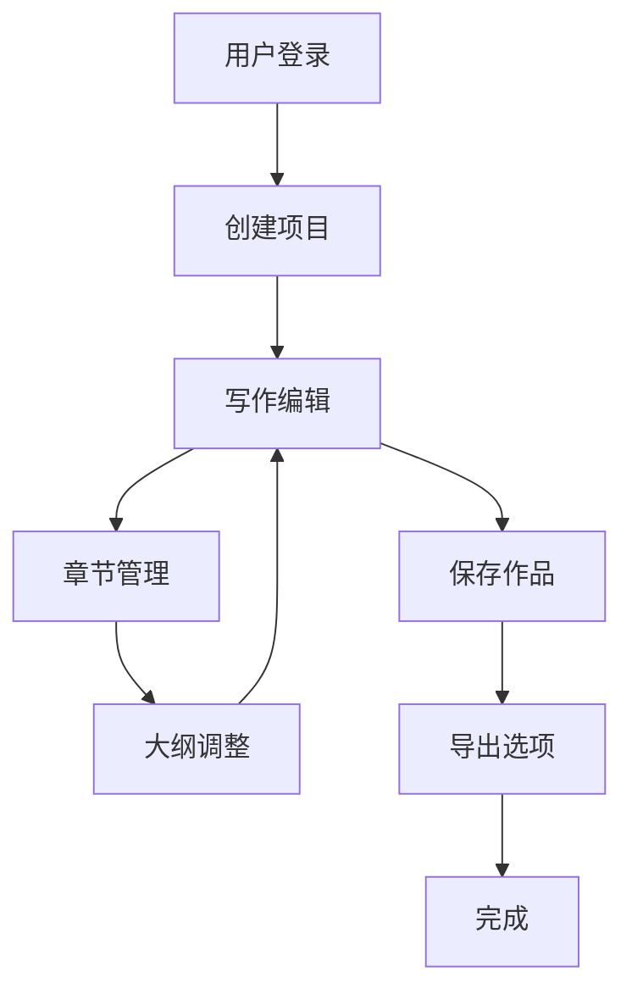

## 1. Product Overview
小说创作平台是一个专为小说创作者设计的在线写作工具，提供丰富的编辑功能和项目管理能力。
- 解决小说创作过程中的组织、编辑和管理问题，帮助作者更专注于创作本身
- 目标用户为小说作家、编剧和文学爱好者，提供专业的写作环境和工具支持

## 2. Core Features

### 2.1 User Roles
| 角色 | 注册方式 | 核心权限 |
|------|----------|----------|
| 普通用户 | 邮箱注册 | 创建和管理个人小说项目，使用基本编辑功能 |
| 高级用户 | 升级订阅 | 额外获得协作功能、高级编辑工具和数据备份 |

### 2.2 Feature Module
1. **首页**：项目列表、快速创建、最近编辑
2. **写作页**：富文本编辑器、章节管理、大纲视图
3. **项目设置**：项目信息、导出选项、协作设置

### 2.3 Page Details
| 页面名称 | 模块名称 | 功能描述 |
|----------|----------|----------|
| 首页 | 项目列表 | 展示用户所有小说项目，支持按状态、创建时间排序，提供搜索功能 |
| 首页 | 快速创建 | 一键创建新小说项目，设置基本信息 |
| 首页 | 最近编辑 | 显示最近编辑的项目，方便快速访问 |
| 写作页 | 富文本编辑器 | 支持文本格式化、章节划分、插入图片和链接，提供拼写检查和字数统计 |
| 写作页 | 章节管理 | 支持添加、删除、重命名章节，拖拽调整章节顺序 |
| 写作页 | 大纲视图 | 可视化展示小说结构，支持拖拽调整大纲，快速定位章节 |
| 项目设置 | 项目信息 | 修改项目标题、简介、分类等基本信息 |
| 项目设置 | 导出选项 | 支持导出为PDF、Word、Markdown等格式 |
| 项目设置 | 协作设置 | 邀请其他用户协作编辑，设置权限级别 |

## 3. Core Process
用户创作小说的主要流程：
1. 用户注册/登录平台
2. 创建新小说项目，设置基本信息
3. 在写作页进行内容创作，使用编辑器功能
4. 通过章节管理和大纲视图组织内容结构
5. 保存作品并在需要时导出

## 4. User Interface Design
### 4.1 Design Style
- 主色调：深蓝色 (#1a365d) 和米色 (#f7f3e9)，营造专业、专注的写作氛围
- 按钮风格：圆角矩形，轻微的阴影效果，悬停时有柔和的过渡动画
- 字体：主要使用 Inter 作为界面字体，正文使用 Georgia 或系统 serif 字体以提高可读性
- 布局风格：左侧固定导航栏，右侧主内容区，顶部状态栏
- 图标风格：简约线条图标，保持一致的视觉语言

### 4.2 Page Design Overview
| 页面名称 | 模块名称 | UI元素 |
|----------|----------|--------|
| 首页 | 项目列表 | 卡片式布局，每个项目卡片显示标题、简介、最近编辑时间，悬停时有轻微放大效果 |
| 首页 | 快速创建 | 突出的加号按钮，点击后弹出模态框，包含项目基本信息表单 |
| 写作页 | 富文本编辑器 | 干净的编辑区域，顶部工具栏包含格式化选项，右侧大纲视图可折叠 |
| 写作页 | 章节管理 | 左侧边栏显示章节列表，支持拖拽排序，点击章节快速跳转 |
| 项目设置 | 导出选项 | 卡片式布局，每个导出格式显示对应的图标和简要说明 |

### 4.3 Responsiveness
- 桌面优先设计，支持响应式布局
- 平板设备：导航栏可折叠，编辑区域自适应宽度
- 移动设备：底部导航栏，编辑区域全屏显示，大纲视图通过模态框访问

### 4.4 3D Scene Guidance
- 不适用，本项目为纯2D界面应用