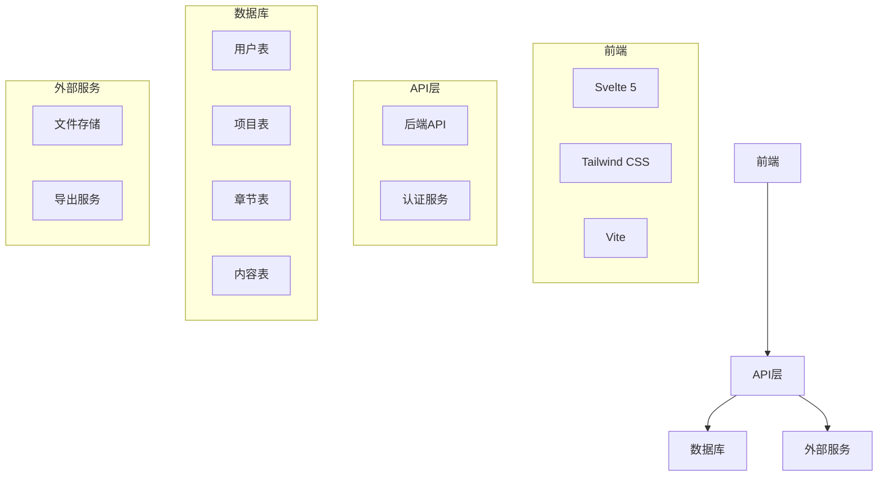
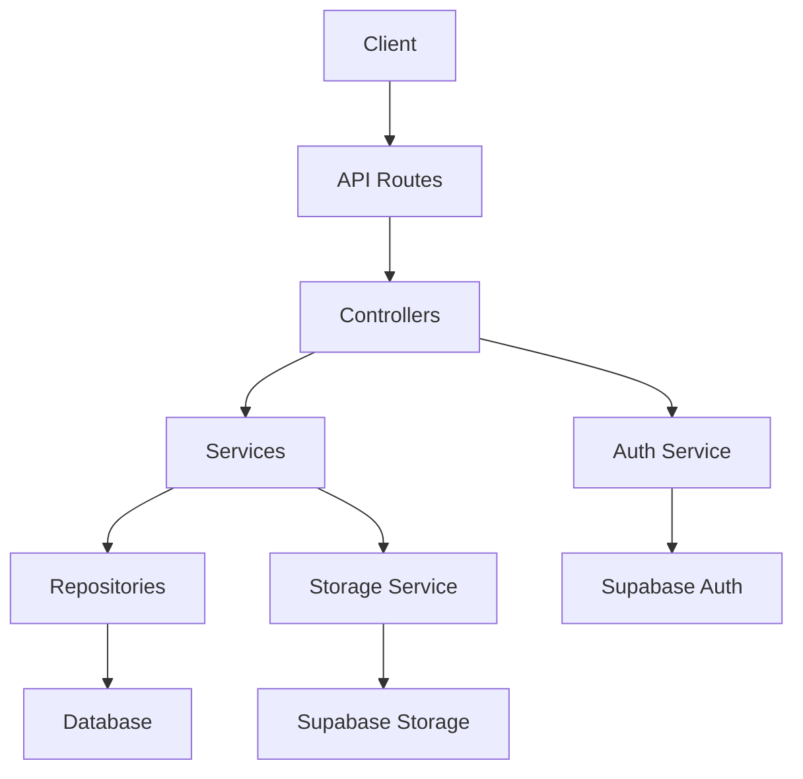
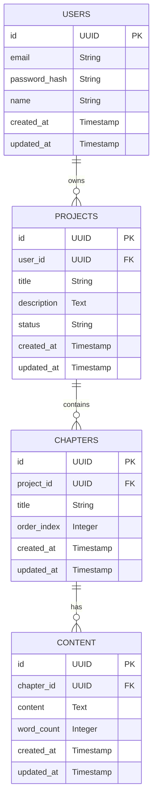

## 1. Architecture Design


## 2. Technology Description
- 前端：Svelte 5 + Tailwind CSS + Vite
- 初始化工具：Vite
- 后端：Express.js (用于API处理和认证)
- 数据库：PostgreSQL (使用Supabase作为BaaS)
- 认证：Supabase Auth
- 存储：Supabase Storage (用于存储用户上传的图片等资源)

## 3. Route Definitions
| 路由 | 用途 |
|------|------|
| / | 首页，展示项目列表 |
| /project/:id | 项目详情页 |
| /project/:id/write | 写作编辑页 |
| /project/:id/settings | 项目设置页 |
| /create | 创建新项目页 |
| /profile | 用户个人资料页 |
| /login | 登录页 |
| /register | 注册页 |

## 4. API Definitions
### 4.1 认证相关API
- POST /api/auth/register - 用户注册
- POST /api/auth/login - 用户登录
- POST /api/auth/logout - 用户登出
- GET /api/auth/me - 获取当前用户信息

### 4.2 项目相关API
- GET /api/projects - 获取用户所有项目
- POST /api/projects - 创建新项目
- GET /api/projects/:id - 获取项目详情
- PUT /api/projects/:id - 更新项目信息
- DELETE /api/projects/:id - 删除项目

### 4.3 章节相关API
- GET /api/projects/:id/chapters - 获取项目所有章节
- POST /api/projects/:id/chapters - 创建新章节
- PUT /api/chapters/:id - 更新章节信息
- DELETE /api/chapters/:id - 删除章节

### 4.4 内容相关API
- GET /api/chapters/:id/content - 获取章节内容
- PUT /api/chapters/:id/content - 更新章节内容

## 5. Server Architecture Diagram


## 6. Data Model
### 6.1 Data Model Definition


### 6.2 Data Definition Language
```sql
-- 创建用户表
CREATE TABLE users (
    id UUID PRIMARY KEY DEFAULT gen_random_uuid(),
    email VARCHAR(255) UNIQUE NOT NULL,
    password_hash VARCHAR(255) NOT NULL,
    name VARCHAR(100) NOT NULL,
    created_at TIMESTAMP DEFAULT NOW(),
    updated_at TIMESTAMP DEFAULT NOW()
);

-- 创建项目表
CREATE TABLE projects (
    id UUID PRIMARY KEY DEFAULT gen_random_uuid(),
    user_id UUID REFERENCES users(id),
    title VARCHAR(255) NOT NULL,
    description TEXT,
    status VARCHAR(50) DEFAULT 'draft',
    created_at TIMESTAMP DEFAULT NOW(),
    updated_at TIMESTAMP DEFAULT NOW()
);

-- 创建章节表
CREATE TABLE chapters (
    id UUID PRIMARY KEY DEFAULT gen_random_uuid(),
    project_id UUID REFERENCES projects(id),
    title VARCHAR(255) NOT NULL,
    order_index INTEGER NOT NULL,
    created_at TIMESTAMP DEFAULT NOW(),
    updated_at TIMESTAMP DEFAULT NOW()
);

-- 创建内容表
CREATE TABLE content (
    id UUID PRIMARY KEY DEFAULT gen_random_uuid(),
    chapter_id UUID REFERENCES chapters(id),
    content TEXT NOT NULL,
    word_count INTEGER DEFAULT 0,
    created_at TIMESTAMP DEFAULT NOW(),
    updated_at TIMESTAMP DEFAULT NOW()
);

-- 创建索引
CREATE INDEX idx_projects_user_id ON projects(user_id);
CREATE INDEX idx_chapters_project_id ON chapters(project_id);
CREATE INDEX idx_content_chapter_id ON content(chapter_id);

-- 授权
GRANT SELECT ON users, projects, chapters, content TO anon;
GRANT ALL PRIVILEGES ON users, projects, chapters, content TO authenticated;
```